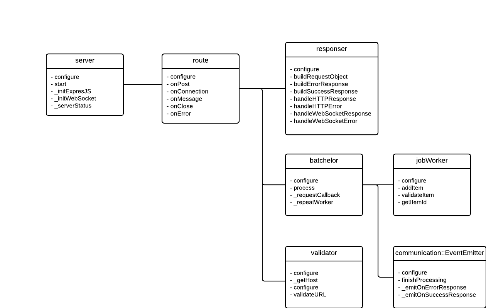
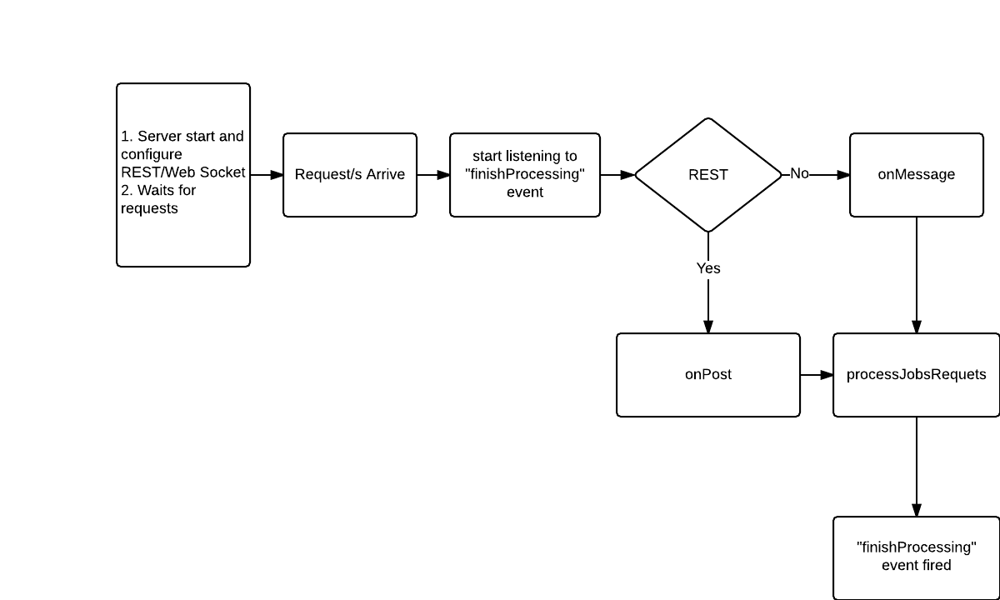

Batchelor
===================
[](http://gruntjs.com/)
[](http://img.shields.io/badge/local%20coverage-91%25-green.svg)

Proxy utility to bundle a batch of calls in one request.
Using the batchelor utility reduces HTTP overhead, network round-trip delay time and helps to keep your API design clean.
Server side parallel request processing.

### Architecture/Flow
* [`Architecture`](#Architecture)
* [`Flow`](#Flow)

### Methods
* [`configure(options)`](#configure)
* [`process(job, callback)`](#process)

### Methodology/Example

* [`job`](#job)
* [`item`](#item)
* [`Examples`](#Examples)


<a name="configure" />
## configure(options)
configure the batchelor object.

* maxconcurrentJobs - integer containing the number of maximum concurrent jobs (default:50)
* logger - object for logging porpouse (default: console).
* maxWorkersPerJob - The maximum number of tasks to run at any time (default:10).
* defaultDelay - integer containing the number of milliseconds to wait between persistent requests (default: 5000)
* maxConcurrentPersistentJobs - integer for determining how many worker functions should be run in parallel for persisntent batch request (default:5)
* timeout - integer containing the number of milliseconds to wait for a request to respond before aborting the request (default: 1000).
* whiteList - an array containing a list of allow host for processing(default: *, meaning allow all host/urls).
* maxItemPerJob - integer for determining how many bacth request per job (default:10)

#### options  example:
```json
{
  maxconcurrentJobs: 100,
  logger: console, //
  maxWorkersPerJob: 10,
  defaultDelay: 2000,
  maxConcurrentPersistentJobs: 10,
  repeatConcurrency: 5,
  timeout: 5000,
  useTooBusy: true,
  whiteList: ["github.com", "hotmail.net"]
  maxItemPerJob
}
```

<a name="process" />
## process(job, callback)

* `job` - A single request object or array of  single requests [required]
* `callback(err, results)` - callback method when finish processimg request/s [required]
- The callback argument gets 2 arguments:
- err - error object, if an error occur, null otherwise
- results - an JSON object conatining the result/s of the request/s

<a name="job" />
## job
An object holding single or array of items, to be batch in the request

<a name="item" />
## item
An object representing a single batch of request. The item must have the following

* `name` - identifier of the item, the name is used as reference. Names must be UNIQUE! [required]
* `url` - URL that calls the item. Possible GET parameters are also given here [required]
* `method` - possible values are `GET` or `POST` or whatever methods the called API supports [required]
* `encoding` - the encoding of the item (default:UTF8) [optional]
* `retries` - number of retries if the timeout is reach (default:2) [optional]
* `headers` - the headers that the item uses [optional]
* `doNotMergeHeaders` - do not merge batchelor request headers with the internal request headers specified (default:false) [optional]
* `body` - the parameters that the item uses when the method is POST are given here [optional]
* `timeout` - number of milliseconds to wait for a request from the API to respond before aborting the request, if this parameters is not provided we use timeout from the config.json file [optional]
* `isOnCloseItem` - flag indicating if the item should be called when the connection is droped (default:false) [optional]
* `isPersistentRequest` - flag indicating if the item should be called in persistent way(default:false) [optional]
* `persistentDelay` - number of delay between persistent items in milliseconds (default:5000) [optional]

<a name="Architecture" />
## Architecture


<a name="Flow" />
## Flow


<a name="Examples" />
## Examples

## REST using ExpressJS Version 4.5.0
```javascript
var exp_app = express();
var compression = require('compression');
var bodyParser = require('body-parser');
var exp_router = express.Router();
exp_app.use(compression());
exp_app.use(bodyParser());
var batchelor = require('batchelor');
var configuration = {
  logger: console,
  maxWorkersPerJob: 10,
  persistentDelay: 2000,
  repeatConcurrency: 5,
  timeout: 5000,
  useTooBusy: true,
  whiteList: ["github.com", "hotmail.net"]
};


batchelor.configure(configuration);
exp_router.post('/', function (req, res, next) {
    batchelor.processJobsRequest(req.body, function (err, results) {
        if (err) {
            console.log("Error occur");
        }
        else {
            res.send(JSON.stringify(results));
        }
    });
});

exp_app.use('/', exp_router);
exp_app.listen(5050);
```
## WebSocket
```javascript
var WebSocketServer = require('ws').Server;
var wss = new WebSocketServer({port: 5050});
var batchelor = require('batchelor');
var configuration = {
  logger: console,
  maxWorkersPerJob: 10,
  persistentDelay: 2000,
  repeatConcurrency: 5,
  timeout: 5000,
  useTooBusy: true,
  whiteList: ["github.com", "hotmail.net"]
};

batchelor.configure(configuration);
ws.on('message', function (data) {
    batchelor.processJobsRequest(data,
        function (err, results) {
            ws.send(JSON.stringify(results));
        });
});
```
## Request - Using WebSocekt facade
```javascript
var job = [
    {
        name: "item1",
        url: "https://www.domain.com/item/1"
        method: "GET",
        retries: 2,
        timeout:5000
    },
    {
        name: "item2",
        url: "https://www.domain.com/item/2"
        method: "POST",
        retries: 5,
        headers: {
            Authorization: "secret 123654789"
        },
        timeout:5000
    }
];
var ws = new WebSocket("wss://yourdomain/path");
ws.onopen = function () {
    document.getElementById("connectionStatus").innerHTML = "Connected";
};
ws.onmessage = function (event) {
    document.getElementById("responseFromServer").value = event.data;
};
```

## Response from previoius request
```json
    {
        item1:{
            body: {name: "myname1", id: 1},
            statusCode: 200,
            headers: {"content-type":"application/json"}
        },
        item2:{
            body: {name: "myname2", id: 2},
            statusCode: 200,
            headers: {"content-type":"application/json"}
        }
    }
```
